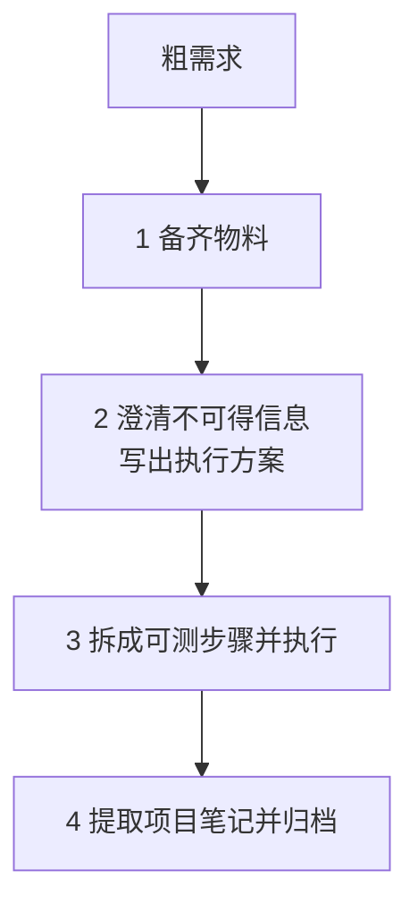

# Workline — 长任务 AI 工作流 Skill 集

**先备齐物料，再问仓库回答不了的问题，把方案拆成可测的步骤，做完把能复用的写进项目笔记。**

[](https://github.com/zhinkgit/workline/actions/workflows/ci.yml)
[](https://www.python.org/)
[](https://claude.ai/code)
[](https://github.com/openai/codex)
[](https://cursor.sh)

长任务容易在对话里散掉：材料没齐就开始问、能查的也问用户、步骤无法单独验证、做完只剩聊天记录。Workline 把一次长任务收成四个阶段，六个独立 Skill 各管一段，状态写在仓库文件里，不靠某一个大 skill 包办全程。一轮能做完的单点修改直接改，不进入这套流程。

六个 Skill 都是**用户显式调用**的（`disable-model-invocation: true`）：模型不会因为你随口提了个需求就自己建活动目录。

---

## 设计哲学

### 1. 先把项目所需的物料准备好

完成任务真正需要的东西——参考实现、协议、样例、旧代码、外部意见——在 `brief.md` 的材料清单里登记路径和用途。

**责任是分开的**：仓库里没有的东西由你准备，两种登记方式二选一——需要随归档保存或被 `refs` 引用的放进活动目录的 `references/` 再登记相对路径，其余直接在表里填外部绝对路径，不必复制；仓库里已有的文件目录由 `workline-grill` 扫出来追加成候选行，你只需确认或剔除。查证是 agent 的活，不是你的活。

澄清开始前先评估材料够不够。不够就指出缺口并停下，而不是用提问向用户索取本该由文件提供的信息。材料不足时硬开问，后面所有决策都会漂在口头转述上。

### 2. 再澄清代码库和物料里拿不到的信息，得出执行方案

代码、`references/`、已有项目笔记能回答的，自己查，不要问。只问这些地方永远给不出的判断：意图、范围、优先级、风险容忍、期望验收行为。

仓库里已有某种写法，只是候选方案，不是决策。尤其是接口、数据格式、删除和兼容性，不能用「现有代码就是这么写的」代替确认。

提问按**设计树分轮**：把当前所有前置已定、彼此独立的问题一轮问完，每题给选项和推荐答案；答案依赖同轮其它问题的自然落到下一轮。一次只问一个会把澄清拖成十几个来回，而分轮不损失任何严谨性——frontier 为空才算问完。

问清楚之后写成 `prd.md`：目标、非目标、带编号的功能要求、可验证的验收标准。这是执行方案，不是聊天纪要。

### 3. 根据方案分解步骤，让每一步可测试、可执行

方案通过后拆成 `tasks.csv`。每一步要能单独实现、单独验证、单独记状态；无人值守的步骤必须写清机器可判定的验证手段和期望结果，手段可以是命令行、Skill 或其他工具。

进度以 CSV 为准，不记在对话里。中断后读活动目录就能恢复。做完一步再做下一步，不把整份方案一次性闷头写完再指望最后一起验。

### 4. 完成后把可用规范提取成项目笔记，以便复用

过程记录（这次做了什么、怎么验的）随活动目录归档。可跨任务复用的结论（本项目是怎样的、为什么）写入 `.workline/notes/`，并把索引挂进项目的 `AGENTS.md` / `CLAUDE.md`——这样「直接改」的单点任务也能读到项目约定，而不是只有走完整流程的任务受益。

新会话读 notes 就能接上约定和踩过的坑，不必翻历史 PRD。没有值得沉淀的内容就明确说没有，不为了填充而写。笔记默认追加，攒多了或发现结论过期时，归档阶段会提议一次需要你确认的合并整理。

---

## 四个阶段如何落地



| 阶段 | Skill | 产物 |
| --- | --- | --- |
| 1 备齐物料 | `workline-init` 建目录；你登记仓库外的材料（放进 `references/` 或直接填外部路径）；`workline-grill` 扫仓库补候选清单并评估是否够用 | `brief.md`、`references/` |
| 2 得出方案 | `workline-grill` 分轮提问并写 PRD；`workline-review` 审查 | `prd.md` |
| 3 可测步骤 | `workline-tasks` 拆表；`workline-review` 再审；你确认后 `workline-run` 按表执行 | `tasks.csv`、`run.md` |
| 4 沉淀复用 | `workline-archive` 检查闭环、写 notes、挂索引、搬进 archive | `.workline/notes/`、`.workline/archive/` |

`workline-review` 插在方案和步骤两道关口：写方案的同一个 agent 不能自己宣布可以拆任务；任务表也必须被当作审查对象看过一遍。「帮我实现 X」是需求，不是执行许可。

项目里只多一个 `.workline/` 目录：

```text
.workline/
├── notes/                          ← 跨任务复用的结论，索引挂进 AGENTS.md / CLAUDE.md
│   └── index.md
├── active/
│   └── 2026-05-28-0915-example/    ← 进行中的一次长任务
│       ├── brief.md                ← 粗需求 + 材料登记
│       ├── prd.md                  ← 执行方案
│       ├── tasks.csv               ← 可测步骤和状态
│       ├── run.md                  ← 阶段门禁 + 执行日志
│       └── references/             ← 需要随归档保存的外部物料；其余外部材料在 brief.md 里填绝对路径
└── archive/
    └── 2026-05/                    ← 完成后按月归档
```

门禁写在 `run.md`（物料确认 → 方案审查 → 步骤审查 → 执行确认）。下一阶段只认这张表。`tasks.csv` 是执行期唯一状态源；`refs` 指向方案条款和物料，不写本任务要改的目标文件。校验由各 Skill 自带的 `workline_csv.py` 完成，调不到脚本就停止。

### `tasks.csv` 组成

固定 10 列，最后一行必须是 `REVIEW`（终审，不写代码，隐式依赖全部任务）。

| 列 | 作用 |
| --- | --- |
| `id` | `T001` 这类编号；末行固定 `REVIEW` |
| `depends_on` | 先完成哪些任务，空格分隔；`REVIEW` 留空 |
| `mode` | `AFK` 无人值守；`HITL` 需要人判断或人手操作 |
| `title` / `description` | 短标题，以及范围和做法 |
| `verification` | 用什么手段、怎样算过。可以是命令行、Skill 或其他工具 |
| `state` | `todo` → `doing` → `done`；条件不够则 `blocked`，确认跳过则 `skipped` |
| `commit` | 本步业务提交的哈希，无改动写 `no-change` |
| `refs` | 执行时加载的材料：`FR-2`、`references/`、`evidence/`、仓库内相对路径（含 `.workline/notes/`）；不写外部绝对路径，也不写本任务要改的目标文件 |
| `notes` | 阻塞、跳过、commit 为空等短备注 |

前 6 列是计划，审查通过后不要改；后 4 列是执行状态。中途加任务用脚本的 `add`，不要手改表头。

`blocked` 的 `notes` 必须以分类前缀开头，脚本会拒绝没有前缀的写入：

| 前缀 | 含义 | 谁来解 |
| --- | --- | --- |
| `wait-user:` | 等人判断、人手操作或外部 ACK | 用户参与后恢复 |
| `env-missing:` | 没装点名的 Skill、没探针、编译器不在 | 补环境后恢复 |
| `verify-failed:` | 验证未通过，本轮不再推进 | 修实现后恢复 |

`next` 优先调度 AFK，收尾时常见「AFK 全 done，其余全 blocked」的局面。分类前缀让 `next` 和 `archive-check` 能直接告诉你「在等人」还是「真炸了」，而不是给你一堆无法区分的 `blocked`。

### 规范写在拒绝里，不写在提示词里

能被脚本拒绝的规则，不再在提示词里重复一遍——**错误消息本身就是规范**，它在拒绝的同时给出完整的正确答案：

```
$ set tasks.csv T001 --state blocked --notes "等一下"
ERROR: state=blocked 的 notes 必须以分类前缀开头，按原因选一个：
  wait-user:     等人判断、人手操作或外部 ACK
  env-missing:   没装点名的 Skill、没探针、编译器不在等环境缺失
  verify-failed: 按 verification 验证未通过
例如 --notes "wait-user: 等用户确认导入页提示"
```

这样做有两个好处：提示词不必为每条规则付出每次触发的 token；规范和实现不可能漂移，因为它们是同一份东西。测试里有专门的用例断言这些消息仍然带着答案，被削成「你错了」就会失败。

代价是这条路只对**形状**成立，对**选择**不成立。`mode` 标反、`verification` 写得无法判定、`refs` 里混进本任务要改的目标文件——这些都合法，脚本一个字都不会说。凡是这类「工具接不住」的规则，才留在 `REFERENCE.md` 里，那份文件现在只写这些。

### 实际运行路径

活动目录建好之后，按文件往下走，不要跳门：

```text
.workline/active/<slug>/
    brief.md + references/     你登记仓库外物料；grill 补齐仓库内候选清单
            │
            ▼  $workline-grill
        prd.md                 分轮澄清后的执行方案
            │
            ▼  $workline-review（审 PRD）
        tasks.csv              $workline-tasks 按 PRD 拆表
            │
            ▼  $workline-review（审任务）
        你确认执行             run.md 里 execute=CONFIRMED
            │
            ▼  $workline-run 循环：
               校验门禁 → next 取下一任务（优先 AFK）
               → 按 refs 加载材料
               → set doing → 实现 → 按 verification 验证
               → 写 run.md → 提交业务改动（不含 .workline/）
               → set done
               → 全部闭环后跑 REVIEW 行
            │
            ▼  $workline-archive
        notes/ + archive/      沉淀可复用结论，挂索引，搬走活动目录
```

推荐这样唤起执行，路径指向那份 CSV：

```text
按 $workline-run 执行 .workline/active/<slug>/tasks.csv
```

中断后用同一条命令恢复：状态在 CSV 里，不在对话里。验证失败保持 `doing` 或标 `verify-failed:`；没装点名的 Skill、没探针、编译器不在，标 `env-missing:`，不是改成等人。

---

## 安装

```bash
# 一键安装全部 skill
npx skills add https://github.com/zhinkgit/workline -g -y

# 只安装需要的 skill
npx skills add https://github.com/zhinkgit/workline --skill workline-init -g -y
```

或直接 clone：

```bash
git clone https://github.com/zhinkgit/workline ~/.claude/skills/workline
```

需要 **Python 3.10+**。六个 Skill 尽量自包含：`workline-tasks` / `workline-run` / `workline-review` / `workline-archive` 各自带一份 `scripts/workline_csv.py` 和一份 `REFERENCE.md`，四份副本逐字一致由 CI 校验；换 agent 加审或单独归档时不必依赖其它 Skill。

有问题请提 [GitHub Issues](https://github.com/zhinkgit/workline/issues)，欢迎贡献 PR。
