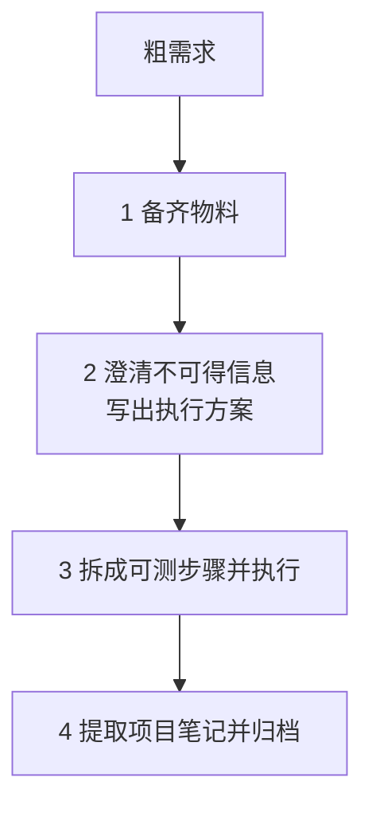

# Workline — 长任务 AI 工作流 Skill 集

**先备齐物料，再问仓库回答不了的问题，把方案拆成可测的步骤，做完把能复用的写进项目笔记。**

[](https://github.com/zhinkgit/workline/actions/workflows/ci.yml)
[](https://www.python.org/)
[](https://claude.ai/code)
[](https://github.com/openai/codex)
[](https://cursor.sh)

长任务容易在对话里散掉：材料没齐就开始问、能查的也问用户、步骤无法单独验证、做完只剩聊天记录。Workline 把一次长任务收成四个阶段，六个独立 Skill 各管一段，状态写在仓库文件里，不靠某一个大 skill 包办全程。一轮能做完的单点修改直接改，不进入这套流程。

---

## 设计哲学

### 1. 先把项目所需的物料准备好

完成任务真正需要的东西——参考实现、协议、样例、旧代码、外部意见——由用户主动收集，放到活动目录的 `references/`，并在 `brief.md` 里登记每份用途。

澄清开始前先评估材料够不够。不够就指出缺口并停下，而不是用提问向用户索取本该由文件提供的信息。材料不足时硬开问，后面所有决策都会漂在口头转述上。

### 2. 再澄清代码库和物料里拿不到的信息，得出执行方案

代码、`references/`、已有项目笔记能回答的，自己查，不要问。只问这些地方永远给不出的判断：意图、范围、优先级、风险容忍、期望验收行为。

仓库里已有某种写法，只是候选方案，不是决策。尤其是接口、数据格式、删除和兼容性，不能用「现有代码就是这么写的」代替确认。

问清楚之后写成 `prd.md`：目标、非目标、带编号的功能要求、可验证的验收标准。这是执行方案，不是聊天纪要。

### 3. 根据方案分解步骤，让每一步可测试、可执行

方案通过后拆成 `tasks.csv`。每一步要能单独实现、单独验证、单独记状态；无人值守的步骤必须带机器可判定的验证命令。

进度以 CSV 为准，不记在对话里。中断后读活动目录就能恢复。做完一步再做下一步，不把整份方案一次性闷头写完再指望最后一起验。

### 4. 完成后把可用规范提取成项目笔记，以便复用

过程记录（这次做了什么、怎么验的）随活动目录归档。可跨任务复用的结论（本项目是怎样的、为什么）写入 `.workline/notes/`。

新会话读 notes 就能接上约定和踩过的坑，不必翻历史 PRD。没有值得沉淀的内容就明确说没有，不为了填充而写。

---

## 四个阶段如何落地



| 阶段 | Skill | 产物 |
| --- | --- | --- |
| 1 备齐物料 | `workline-init` 建目录；你放入 `references/`；`workline-grill` 评估是否够用 | `brief.md`、`references/` |
| 2 得出方案 | `workline-grill` 逐问并写 PRD；`workline-review` 审查 | `prd.md` |
| 3 可测步骤 | `workline-tasks` 拆表；`workline-review` 再审；你确认后 `workline-run` 按表执行 | `tasks.csv`、`run.md` |
| 4 沉淀复用 | `workline-archive` 检查闭环、写 notes、搬进 archive | `.workline/notes/`、`.workline/archive/` |

`workline-review` 插在方案和步骤两道关口：写方案的同一个 agent 不能自己宣布可以拆任务；任务表也必须被当作审查对象看过一遍。「帮我实现 X」是需求，不是执行许可。

项目里只多一个 `.workline/` 目录：

```text
.workline/
├── notes/                          ← 跨任务复用的结论
│   └── index.md
├── active/
│   └── 2026-05-28-0915-example/    ← 进行中的一次长任务
│       ├── brief.md                ← 粗需求 + 材料登记
│       ├── prd.md                  ← 执行方案
│       ├── tasks.csv               ← 可测步骤和状态
│       ├── run.md                  ← 阶段门禁 + 执行日志
│       └── references/             ← 你放入的物料
└── archive/
    └── 2026-05/                    ← 完成后按月归档
```

门禁写在 `run.md`（物料确认 → 方案审查 → 步骤审查 → 执行确认）。下一阶段只认这张表。`tasks.csv` 是执行期唯一状态源；`refs` 指向方案条款和物料，不写源码路径。校验由各 Skill 自带的 `workline_csv.py` 完成，调不到脚本就停止。

---

## 安装

```bash
# 一键安装全部 skill
npx skills add https://github.com/zhinkgit/workline -g -y

# 只安装需要的 skill
npx skills add https://github.com/zhinkgit/workline --skill workline-init -g -y
```

或直接 clone：

```bash
git clone https://github.com/zhinkgit/workline ~/.claude/skills/workline
```

需要 **Python 3.10+**。六个 Skill 尽量自包含；`workline-review` 和 `workline-archive` 自带同一份脚本，换 agent 加审或单独归档时不必依赖其它 Skill。

有问题请提 [GitHub Issues](https://github.com/zhinkgit/workline/issues)，欢迎贡献 PR。
